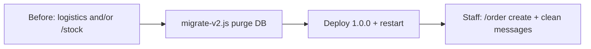

# Migrations

Upgrade guides for **self-host** instances. Always **backup MongoDB** before running a script.

Full ops guide (install, env, wiki): [SELF-HOST.md](SELF-HOST.md). Player usage: [USAGE.md](USAGE.md). Product notes: [CHANGELOG.md](../CHANGELOG.md).

| From → to | Section |
|-----------|---------|
| Pre-1.0.0 (logistics / inventory `/stock`) → **1.0.0** | [below](#release-100--changes-migration-and-validation) |

---

# Release 1.0.0 — changes, migration, and validation

## 0. Before / after for an existing production server

1.0.0 **does not convert** old logistics into orders. It is a **cut + purge**, then staff recreate useful boards.

| Data / UX (before 1.0.0) | After 1.0.0 upgrade |
|--------------------------|---------------------|
| Group logistics threads, `/logistics`, `/material` | **Deleted in DB** (`groups`, legacy materials). Dead buttons if Discord messages remain. |
| Inventory boards `/stock` + `Material` lines | **Deleted in DB** (`stocks`, `materials`). Summary/panel Discord messages may remain orphaned → delete manually in the channel. |
| Tracked `stock_summary:*` / `stock_panel:*` | **Purged** DB refs (no inventory resync). |
| `/stockpile` codes | **Kept**; `group_id` → `channel_id` if needed; list resyncs on ready. |
| In-progress `/operation` | **Kept** (same collection). |
| Slash stats keys `logistics` / `stock` / … | Obsolete keys **cleaned**. |
| New logistics need | Recreate with **`/order create`** (prod, transfer, or scrap); optional OP link. |

**Who does what**

1. **Bot ops (self-host / official instance)**: backup → `migrate-v2.js` → deploy 1.0.0 → restart.  
2. **Each Discord server**: no DB action; after restart, slash commands change. Logistics leads **recreate** `/order` boards and **delete** old inventory/logistics messages still visible.  
3. **Nothing is auto-migrated** inventory → order (inventory current/target ≠ OP order).



---

## 1. What changes (summary)

### Breaking

| Before | After |
|--------|--------|
| `/logistics`, `/material`, Group threads | **Removed** |
| Channel inventory `/stock` (selects, priority, ±qty) | **Removed** |
| Ask/given / assignee requests | **Removed** |
| `Stockpile.group_id` | **`channel_id`** |
| `/create_operation`, `/notification`, `/foxhole` | **`/operation`**, **`/notify`**, merged into **`/war`** |

### New logistics core

| Item | Detail |
|------|--------|
| Slash | **`/order`** — `create` / `remove` |
| Board kinds | **Production** · **Front transfer** · **Scrap / farm** |
| Line | `current/target` + **priority** + auto **urgency** (URGENT / OK / LOW) |
| Interaction | **Select** a line → **-1 / +1 / +4 / +9 / Max** · Priority · Add · Correct · Close |
| Logs | Optional (`Server.logs`, default **false**) — **locked** Discord thread if enabled; purged on remove / `/server logs false` |
| OP link | Optional `operation` at create |
| Data | `OrderBoard` (`log_thread_id`, `selected_line_id`, …) / `OrderLine` (`priority`, …) |

### Unchanged (role)

- **`/operation`** — OP announce / lifecycle  
- **`/stockpile`** — depot codes  
- **`/notify`**, **`/war`**, setup / server / help  

---

## 2. Migration (self-host / instance)

Run **once** against the bot’s MongoDB (one DB = all guilds).

### Prerequisites

- Bot stopped (recommended)
- Same prod `.env` (`MONGODB_URL`, `MONGODB_NAME`)
- Ability to restart afterward

### 2.1 Backup

```bash
mongodump --uri="$MONGODB_URL/$MONGODB_NAME" --out="./backup-pre-1.0.0-$(date +%Y%m%d)"
```

### 2.2 Dry-run

```bash
node scripts/migrate-v2.js --dry-run
```

Steps:

1. **`purgeLogistics`** — drop `groups`; purge `materials` + `stocks`; obsolete tracked types; keep `stockpile_list` (+ `order_board:*` if already present)
2. **`migrateStockpileChannelId`** — `group_id` → `channel_id`
3. **`cleanupStats`** — dead slash keys

### MongoDB collections touched

For self-host operators: the script acts on **your** database (`MONGODB_NAME`). You do **not** need to drop collections by hand if you run `migrate-v2.js`.

| Collection | Script action |
|------------|---------------|
| **`materials`** | `deleteMany` — emptied |
| **`stocks`** | `deleteMany` — inventory `/stock` emptied |
| **`groups`** | **`drop`** collection (legacy logistics) |
| **`trackedmessages`** | **partial** delete: obsolete types (`stock_summary:*`, `stock_panel:*`, logistics, …); **keeps** `stockpile_list` (and `order_board:*` if present) |
| **`stockpiles`** | **kept** — `group_id` → `channel_id` only |
| **`operations`**, **`servers`**, **`notificationsubscriptions`** | **kept** |
| **`stats`** | **kept** — prune obsolete slash command keys |
| **`orderboards`**, **`orderlines`** | **untouched** (created in use after 1.0.0) |

Do **not** drop the whole DB. To inspect before apply: `node scripts/migrate-v2.js --dry-run` prints counters (`materialsDeleted`, `stocksDeleted`, `groupsDropped`, `trackedDeleted`, …).

### 2.3 Apply

```bash
node scripts/migrate-v2.js
```

### 2.4 Deploy 1.0.0 + restart

On `ready`:

- registers **`/order`**, removes **`/stock`**
- `syncAllOrderBoards` + `syncAllStockpileLists`

With `APP_ENV=dev`, only **guild** slash commands are pushed: clear leftover **global** Discord commands if old ones still appear.

### 2.5 Server staff (after restart)

- Manually delete old inventory / logistics messages still in channels (migrate does not delete Discord messages, only DB refs).
- Recreate useful boards: `/order create` …
- Tell users `/stock` / logistics are gone.

---

## 3. How to validate

### 3.1 Automated tests

```bash
npm test
```

Order coverage: models, services, embeds, slash, autocomplete, buttons, modals, sync, permissions, migrate helpers.

### 3.2 Manual smoke — Orders

- [ ] `/setup` / server with `logs:false` (default) → `/order create` **without** Logs thread
- [ ] `/server logs enabled:true` then new board → **Logs thread** created and **locked**
- [ ] `/server reset confirm:false` → count preview
- [ ] `/server reset confirm:true` → wipe boards + stockpiles + operations (config/notifications intact); op messages with `channel_id` deleted
- [ ] Restart bot → slash `/order` / `/server reset` visible (re-register at boot)
- [ ] `/order create type:prod name:TestProd` → embed + select + buttons
- [ ] **Add** → target → line `0/N`; add log in thread (if logs on)
- [ ] Select a line → **-1 / +1 / +4 / +9 / Max**; checkmark when target reached; qty/max logs
- [ ] **Priority** cycle; urgency displayed
- [ ] **Correct** (current/target); **Close**
- [ ] **Front transfer** and **Scrap / farm** boards
- [ ] `operation:` link
- [ ] `/order remove` → message + logs thread (if any) + DB
- [ ] `/server logs enabled:false` → purge existing Logs threads

### 3.3 Manual smoke — Regression

- [ ] `/stockpile` add / list / reset
- [ ] `/operation` create / start / finish / cancel
- [ ] `/notify`, `/war`
- [ ] `/stock` / logistics / material **absent**
- [ ] `/help` → order
- [ ] Ready logs: OrderBoard + StockpileList OK
- [ ] Bot permissions: Create Public Threads + Send Messages in Threads

### 3.4 Post-migration

- [ ] Backup kept until smoke OK
- [ ] migrate applied
- [ ] Bot restarted, slash up to date
- [ ] Old Discord messages cleaned in affected channels
- [ ] At least one test `/order` per active guild if needed
