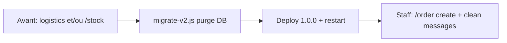

# Release 1.0.0 — changements, migration et validation

Guide unique pour self-host et QA. Notes produit détaillées : [CHANGELOG.md](../CHANGELOG.md).

---

## 0. Avant / après pour un serveur déjà en prod

La 1.0.0 **ne convertit pas** l’ancienne logi en commandes. C’est une **coupure + purge**, puis recreation manuelle des boards utiles.

| Données / UX (avant 1.0.0) | Après upgrade 1.0.0 |
|----------------------------|---------------------|
| Threads / Group logistics, `/logistics`, `/material` | **Effacés en DB** (`groups`, materials legacy). Boutons morts si messages Discord restent. |
| Boards inventaire `/stock` + lignes `Material` | **Effacés en DB** (`stocks`, `materials`). Messages résumé/panneau Discord peuvent rester orphelins → à supprimer à la main dans le salon. |
| Tracked `stock_summary:*` / `stock_panel:*` | **Purge** des refs en DB (plus de resync inventaire). |
| Codes `/stockpile` | **Conservés** ; `group_id` → `channel_id` si besoin ; liste resync au ready. |
| `/operation` en cours | **Conservées** (même collection). |
| Stats slash `logistics` / `stock` / … | Clés obsolètes **nettoyées**. |
| Nouveau besoin logi | Recréer avec **`/order create`** (prod, transfert ou scrap) ; lien OP optionnel. |

**Qui fait quoi**

1. **Ops du bot (self-host / instance officielle)** : backup → `migrate-v2.js` → déployer le code 1.0.0 → restart.  
2. **Chaque serveur Discord** : pas d’action DB ; après restart, les slash changent. Les leads logi **recrée** les tableaux `/order` et **supprime** les vieux messages inventaire/logistics encore visibles.  
3. **Rien n’est migré automatiquement** inventaire → ordre (actuel/cible inventaire ≠ commande OP).



---

## 1. Ce qui change (résumé)

### Breaking

| Avant | Après |
|-------|--------|
| `/logistics`, `/material`, threads Group | **Supprimés** |
| Inventaire salon `/stock` (selects, priorité, ±qty) | **Supprimé** |
| Demandes ask/given / assignee | **Supprimés** |
| `Stockpile.group_id` | **`channel_id`** |
| `/create_operation`, `/notification`, `/foxhole` | **`/operation`**, **`/notify`**, fusion dans **`/war`** |

### Nouveau cœur logi

| Élément | Détail |
|---------|--------|
| Slash | **`/order`** (FR **`/commande`**) — `create` / `remove` |
| Types de board | **Production** · **Transfert front** · **Scrap / farm** |
| Ligne | `actuel/objectif` + **priorité** + **urgence** auto (URGENT / OK / BAS) |
| Interaction | **Sélection** d’une ligne → **-1 / +1 / +4 / +9 / Max** · Priorité · Ajouter · Corriger · Clôturer |
| Logs | Optionnel (`Server.logs`, défaut **false**) — thread Discord **verrouillé** si activé ; purge au remove / `/server logs false` |
| Lien OP | Option `operation` à la création |
| Données | `OrderBoard` (`log_thread_id`, `selected_line_id`, …) / `OrderLine` (`priority`, …) |

### Inchangé (rôle)

- **`/operation`** — annonce / cycle d’OP  
- **`/stockpile`** (FR **`depot`**) — codes dépôt  
- **`/notify`**, **`/war`**, setup / server / help  

---

## 2. Migration (self-host / instance)

À lancer **une fois** sur la Mongo du bot (pas par serveur Discord séparément : une DB = tous les guilds).

### Prérequis

- Bot arrêté (recommandé)
- Même `.env` prod (`MONGODB_URL`, `MONGODB_NAME`)
- Possibilité de redémarrer après

### 2.1 Backup

```bash
mongodump --uri="$MONGODB_URL/$MONGODB_NAME" --out="./backup-pre-1.0.0-$(date +%Y%m%d)"
```

### 2.2 Dry-run

```bash
node scripts/migrate-v2.js --dry-run
```

Étapes :

1. **`purgeLogistics`** — drop `groups` ; purge `materials` + `stocks` ; tracked obsolètes ; garde `stockpile_list` (+ `order_board:*` si déjà présents)
2. **`migrateStockpileChannelId`** — `group_id` → `channel_id`
3. **`cleanupStats`** — clés slash mortes

### Collections MongoDB touchées

Pour les hébergeurs self-host : le script agit sur **ta** base (`MONGODB_NAME`). Tu n’as **pas** besoin de dropper des collections à la main si tu lances `migrate-v2.js`.

| Collection | Action du script |
|------------|------------------|
| **`materials`** | `deleteMany` — tout vidé |
| **`stocks`** | `deleteMany` — inventaire `/stock` vidé |
| **`groups`** | **`drop`** de la collection (legacy logistics) |
| **`trackedmessages`** | delete **partiel** : types obsolètes (`stock_summary:*`, `stock_panel:*`, logistics, …) ; **conserve** `stockpile_list` (et `order_board:*` si présents) |
| **`stockpiles`** | **conservée** — migration `group_id` → `channel_id` uniquement |
| **`operations`**, **`servers`**, **`notificationsubscriptions`** | **conservées** |
| **`stats`** | **conservée** — prune des clés de commandes slash obsolètes |
| **`orderboards`**, **`orderlines`** | **non touchées** (créées à l’usage après 1.0.0) |

Ne drop **pas** toute la DB. Si tu veux vérifier avant apply : `node scripts/migrate-v2.js --dry-run` affiche les compteurs (`materialsDeleted`, `stocksDeleted`, `groupsDropped`, `trackedDeleted`, …).

### 2.3 Appliquer

```bash
node scripts/migrate-v2.js
```

### 2.4 Deploy code 1.0.0 + restart

Au `ready` :

- enregistre **`/order`** / **`/commande`**, retire **`/stock`**
- `syncAllOrderBoards` + `syncAllStockpileLists`

En `APP_ENV=dev`, seules les slash **guild** sont poussées : nettoyer les commandes **globales** Discord si d’anciennes restent visibles.

### 2.5 Côté staff serveur (après restart)

- Supprimer manuellement les anciens messages inventaire / logistics encore dans les salons (la migrate ne les delete pas sur Discord, seulement les refs DB).
- Recréer les commandes utiles : `/order create` …
- Annoncer le changement aux users (plus de `/stock` / logistics).

---

## 3. Comment tout checker

### 3.1 Tests auto

```bash
npm test
```

Couverture order : modèles, services, embeds, slash, autocomplete, boutons, modals, sync, permissions, migrate helpers.

### 3.2 Smoke manuel — Orders

- [ ] `/setup` / serveur avec `logs:false` (défaut) → `/order create` **sans** thread Logs
- [ ] `/server logs enabled:true` puis nouveau board → **thread Logs** créé et **verrouillé**
- [ ] `/server reset confirm:false` → aperçu des counts
- [ ] `/server reset confirm:true` → wipe boards + stockpiles + opérations (config/notifs intactes) ; messages d’ops avec `channel_id` supprimés
- [ ] Restart bot → slash `/order` / `/server reset` visibles (re-register au boot)
- [ ] `/order create type:Production name:TestProd` → embed + select + boutons
- [ ] **Ajouter** → objectif → ligne `0/N` ; log d’ajout dans le thread (si logs on)
- [ ] Sélectionner une ligne → **-1 / +1 / +4 / +9 / Max** ; ✅ si objectif atteint ; logs qty/max
- [ ] **Priorité** cycle (🔻/➖/🔺) ; urgence affichée
- [ ] **Corriger** (actuel/objectif) ; **Clôturer**
- [ ] Board **Transfert front** et **Scrap / farm**
- [ ] Lien `operation:`
- [ ] `/order remove` → message + thread logs (s’il existait) + DB
- [ ] `/server logs enabled:false` → purge des threads Logs existants

### 3.3 Smoke manuel — Régression

- [ ] `/stockpile` add / list / reset
- [ ] `/operation` create / start / finish / cancel
- [ ] `/notify`, `/war`
- [ ] `/stock` / logistics / material **absents**
- [ ] `/help` → order / commande
- [ ] Logs ready OrderBoard + StockpileList OK
- [ ] Permissions bot : Create Public Threads + Send Messages in Threads

### 3.4 Post-migration

- [ ] Backup gardé jusqu’à smoke OK
- [ ] migrate appliqué
- [ ] Bot redémarré, slash à jour
- [ ] Anciens messages Discord nettoyés dans les salons concernés
- [ ] Au moins un `/order` de test créé par guild actif si besoin
